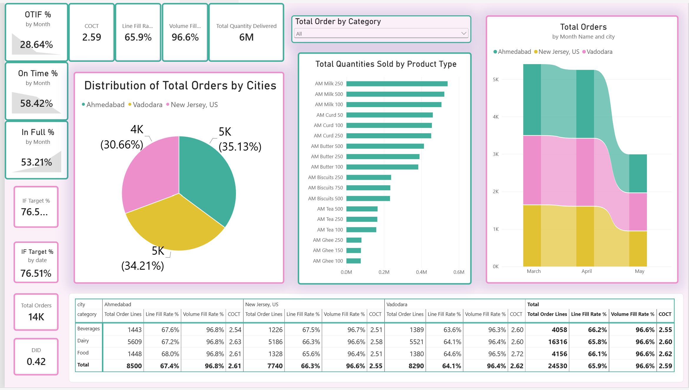
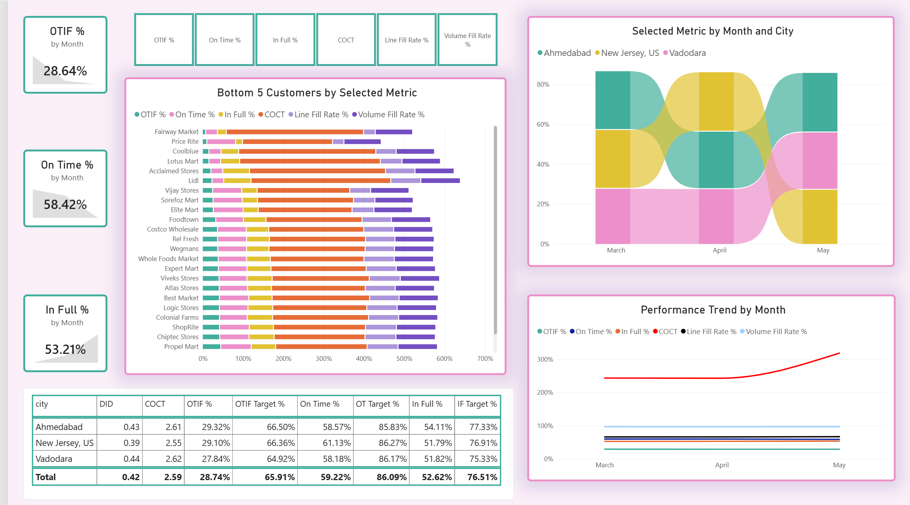
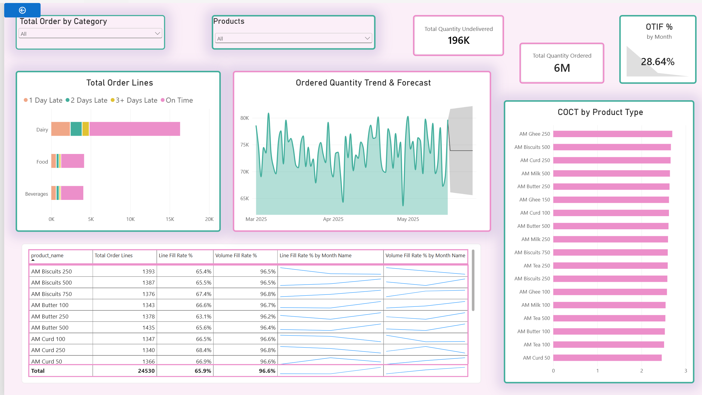

# AtliQ Mart OTIF Performance Analysis 📦

This is my end to end Power BI project built as part of the Codebasics Project Challenge. AtliQ Mart is an FMCG distributor, and this project looks at why their order deliveries are falling short of target and exactly where the problem is coming from.

## 📌 About the Project

AtliQ Mart's management wants to know why their **OTIF (On Time In Full)** score is low. I was given raw order data across two regions (India and USA) and had to clean it, build a proper data model, calculate all the required metrics, and put together a dashboard that management can actually use to find the problem not just see a low number.

## ❓ Problem Statement

* Overall OTIF% is well below target, but nobody knew if it was because deliveries were late, incomplete, or both.
* There was no clear view of which cities or products were causing the most trouble.
* The raw data was spread across 9 separate files and had data quality issues that needed to be fixed before any analysis could be trusted.

## 🗃️ Dataset

The data came as 9 CSV files:
* 3 dimension files: customers, products, and delivery targets
* 2 master fact files: order level data and order line level data
* 4 incremental files: extra daily order data split by region (India/USA) and currency (INR/USD)

## 🛠️ Tools Used

* **Power Query (M):** for cleaning and transforming the raw data
* **Power BI Data Modeling:** for building the star schema
* **DAX:** for writing all the measures
* **Power BI Desktop:** for building the dashboard

## 🚀 What I Did

**1. Data Cleaning & Transformation (Power Query)**
Promoted headers, fixed column data types, and combined the regional/currency files into two clean master tables: `fact_aggregate_final` and `fact_order_line_final`. I ran into a tricky bug here — dates in `DD-MM-YYYY` format were being read incorrectly because of locale settings, which silently corrupted any date with a day value above 12. I fixed this by parsing every date column using the English (UK) locale and checking column quality against the *entire* dataset instead of just the default 1,000-row sample, which is what let me actually catch the error in the first place.

**2. Data Modeling**
Built a star schema with `dim_customers`, `dim_products`, and `dim_date` all connected to both fact tables, so everything could be sliced consistently by customer, city, product, category, and time.

**3. DAX Measures**
Wrote 21 measures covering order counts, OT%/IF%/OTIF% and their targets and gaps, line-level fill rates, cycle time, and delivery delay — plus one calculated column to bucket orders by how late they were. Full list is in `DAX_Measures_and_Glossary.md`.

**4. Dashboard (3 pages)**
* **Overview:** top level KPIs against target, order distribution by category and city, and a monthly trend by city
* **City Performance:** city level performance table, a metric switcher that drives a trend chart, and a bottom 5 customers view
* **Product Performance:** quantity/OTIF summary, delay breakdown by category, cycle time by product, and a forecast of future order quantity

## 📊 Dashboard

**Overview**

**City Performance**

**Product Performance**

**Data Model**

## 📈 Key Insights

* OTIF% is **28.7%** against a **65.9%** target, In Full% (52.6% vs 76.5%) is the bigger drag than On Time% (59.2% vs 86.1%).
* OTIF% barely changes across cities (27.8%–29.3%), the problem is systemic, not tied to one location.
* Volume Fill Rate (96.6%) is strong but Line Fill Rate (65.9%) is weak, orders are short shipping individual line items, not failing on bulk volume.
* Delivery delay is small (0.42 days) but Customer Order Cycle Time is not (2.6 days), the real issue is how long delivery takes overall, not lateness against the promised date.

## 🧠 What I Learned

* OTIF is measured at the order level, so one missed line item fails the entire order that's why OTIF% is always lower than On Time% or In Full% on their own.
* Line level and order level metrics can tell completely different stories, so it's worth tracking both instead of relying on just one.
* A data quality check on a row sample isn't enough real errors can hide past the sample and only show up when you check the full dataset.
* Field Parameters are a great way to let one chart switch between multiple metrics instead of building a separate visual for each one.

## 📁 Repository Contents

* `README.md` — this file
* `DAX_Measures_and_Glossary.md` — every DAX measure used in the model, plus a glossary of all abbreviations

## 🔗 Reference

* [Codebasics Resume Project Challenge](https://codebasics.io/challenges/codebasics-resume-project-challenge/5)

## 🤝 Connect with Me

* LinkedIn: www.linkedin.com/in/thanyamanivannan
* Email: thanyamanivannan@gmail.com
